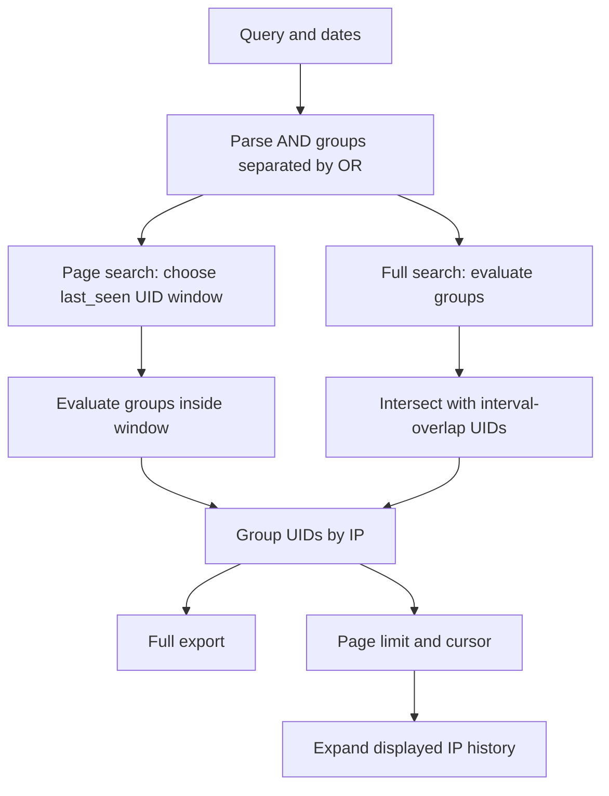

# Search engine: implementation and change contract

Read this guide before modifying search parsing, Kvrocks reads/indexes, search
pagination, exports, or tag matching. Update it in the same change when the
documented behavior changes. Search matching loops were restored to commit
`66dfbb2` after the #161 performance regression described below. Subsequent
request diagnostics and scoped timestamp reads are documented here.

Related references: [key schema](../kvrocks_objects.md), [user search syntax](../search.md),
[tag rules](https://github.com/D4-project/Plum-Antibodies/blob/main/documentation/tagging.md),
and [repository instructions](../../AGENT.md).
Function names below are navigation anchors; line numbers drift as code changes.

## Ownership and data flow

| Component | Responsibility |
| --- | --- |
| [result_parser.py](../../webapp/app/utils/result_parser.py), `parse_json` | Produce UID, IP, timestamps and parsed field values; compute tags |
| [kvrocks.py](../../webapp/app/utils/kvrocks.py), `KVrocksIndexer` | Write/read reverse indexes; return matching UID sets and metadata |
| [views.py](../../webapp/app/views.py), `KVSearchView` | Parse queries, evaluate OR groups, select time scopes, group by IP, paginate and export |
| [search_kvrocks.html](../../webapp/app/templates/search_kvrocks.html) | Collect dates, fetch adaptive pages, render IPs, request history/tags |
| [show_targetsview.html](../../webapp/app/templates/show_targetsview.html) | Query a target from its oldest displayed scan through now; render target results and request tags |
| [ip_tag_enrichment.js](../../webapp/app/static/js/ip_tag_enrichment.js) | Shared asynchronous, batched tag retrieval for structured search and target results |
| [tagrules.py](../../webapp/app/utils/tagrules.py) | Compile queries and evaluate rules against parsed documents in memory |



Meilisearch stores full scan documents and serves the separate Token Search UI.
Kvrocks stores the structured search indexes. SQLite stores application state and
rule definitions. Do not route structured filters through Meilisearch as a fallback.

The unit of matching is a document UID, not an IP. Group by IP only after evaluating
the query. Two different UIDs for the same IP must not jointly satisfy an AND query.
Do not introduce new port-level correlation into this UID-based engine as part of
a read optimization; inspect the parser's document shape for a separate such change.

## Storage invariants

- `{field}:{value}` is a set of UIDs, used for matching.
- `{field}s:{uid}` is a set of values, used to inspect one document. For example,
  `http_title:vault` and `http_titles:<uid>` have opposite directions.
- Generic indexed values are lowercased. `_get_matching_uids` also lowercases
  criteria before invoking the indexer. Direct indexer callers must respect that
  convention; generic matching itself does not lowercase every argument.
- `uid:{uid}` maps UID to IP; `doc:{uid}` carries `ip`, `first_seen`, `last_seen`.
- Sorted sets `first_seen_index` and `last_seen_index` store epoch-second scores.
- Tags use `tag:product:nginx` for reverse lookup and `tags:{uid}` for document
  values. Raw Meilisearch documents do not carry computed tags.
- Indexed networks cover IPv4 `/16` through `/24`. `_get_uids_for_net_value`
  expands wider queries into `/16` scopes or uses a `/24` parent for narrower
  queries, then checks candidate IPs for masks outside the indexed range.

A read-only optimization requires no migration or rebuild. Adding a searchable
field requires coordinated parser output, index keyword registration, parser
acceptance and user documentation; existing data may then require reindexing.
Never change `first_seen` or rebuild indexes merely to optimize reads.

## Parsing and field matching

`parse_query` tokenizes with `shlex`, separates explicit OR groups, then calls
`_parse_query_group_with_not`, which validates field terms with `parse_query_group`.
Explicit AND is optional. Repeated fields are stored as lists,
not overwritten. Parenthesized Boolean expressions are not implemented.

Examples after parsing:

```text
http_server.lk:nginx port:443 OR http_title.bg:welcome
=> [{"http_server.lk": ["nginx"], "port": ["443"]},
    {"http_title.bg": ["welcome"]}]

http_headval:x-powered-by.lk:php
=> [{"http_headval.lk": ["x-powered-by:php"]}]
```

Exact generic matching reads `SMEMBERS {field}:{value}`. Modifier searches scan
`{field}:*` and compare the value portion in Python. `.like`/`.lk` mean substring;
`.begin`/`.bg` mean prefix. Preserve literal text, including colons and backslash
sequences; do not substitute glob matching for these comparisons.

`_modifier_matches(indexed_value, search_value, suffix)` has that exact argument
order. Swapping the final two arguments changes matching results.

HTTP values use `_parse_http_headval_term` and `_get_uids_for_http_headval`.
The header name is exact; a modifier applies only to its value. Names containing
glob metacharacters are escaped for SCAN. Values may contain additional colons.
Header collection and its automatic additions from active YAML rules control what
is available in the index; batching cannot recover uncollected values.

### Standalone NOT

`NOT` binds to the next field term only, case-insensitively. An OR group requires
at least one positive term, avoiding an implicit all-document universe. Missing
operands, repeated NOT, NOT before AND/OR, and negated debug/since directives are
rejected. Validate before directive/AND removal so the operand cannot silently
shift. Parenthesized expressions are not supported. Legacy `.not`/`.nt` behavior
is preserved; those suffixes cannot be combined with standalone NOT.

Compiled groups keep their flat field-to-list structure. A leading `!` is an
internal marker on a negated field, never a user-facing field or index key:

```text
tag:type:router and not tag:vendor:mikrotik
=> [{"tag": ["type:router"], "!tag": ["vendor:mikrotik"]}]
```

`_get_matching_uids` evaluates the positive criteria through the existing scoped
or unscoped path. For each negative value, it evaluates the ordinary positive
field predicate through `get_uids_by_criteria_scoped`, restricted to remaining
group UIDs, then subtracts that result. Repeated negative values exclude their
union; they must not be merged into one positive AND predicate. Empty positive
results skip exclusion reads. Union the completed groups only after exclusions.
Do not pass `!` fields directly into the indexer or reorder positive predicates.

This is UID-level exclusion. A non-excluded matching UID can retain an IP whose
other scans carry the excluded value. Missing excluded fields also pass. The
broader asynchronous tag aggregation remains unchanged and may display excluded
tags from other scans. Page/full searches and `expand_ips` share the evaluator,
so exports and matching history apply the same exclusions while retaining their
distinct date scopes and existing pagination/order rules.

The in-memory tag-rule evaluator strips `!` and inverts the existing document
field predicate for each value. Header dependency analysis also strips it so
headers needed for negative rules remain collected. No tag-rule chaining is
introduced: computed tags are not input fields of parsed documents. Existing
differences in positive field evaluation between index search and in-memory tag
rules are not changed by the negation wrapper.

Tests cover the router/MikroTik example, same-IP mixed history, missing excluded
values, repeated exclusions, OR isolation, scoped/full date differences, quoted
values, malformed operators/directives, header dependencies and pagination past
100 IPs. Negation adds the reads needed for its predicates, including global field
scans for substring/prefix terms; it is a feature, not a performance optimization.

`since:N` is a time directive, removed from search criteria when allowed. One
positive integer is accepted. In the backend, if either date bound is omitted,
the directive supplies both inclusive UTC day bounds. Two explicit bounds take
precedence. Preserve validation and precedence when changing date handling.

## UID evaluation

`_get_matching_uids` evaluates each OR group independently, subtracts its NOT
matches as described above, and unions the completed results.

`get_uids_by_criteria` currently:

1. Seeds from supplied IP and network criteria. Multiple IP/network alternatives
   are unioned, including IP plus network; they are not a generic AND intersection.
2. Otherwise seeks a usable exact criterion (or header-value lookup) as a seed.
3. If no seed is found, scans a base field to collect candidate UIDs. The selected
   criterion remains to be evaluated; collecting candidates is not matching it.
4. Intersects the remaining criterion values with the current candidates.

`get_uids_by_criteria_scoped` starts from supplied UIDs, intersects any IP/network
seed with that scope, then evaluates remaining criteria within it. Empty scopes
must not fall back to unscoped search. Preserve current early returns and do not
mutate caller-owned criteria or scope containers.

Generic repeated values intersect. Existing fallback and special-field behavior
must be characterized before refactoring: in particular, the unscoped header-value
fallback unions values and removes that field. Do not assume every internal branch
implements an idealized Boolean algebra or reorder criteria casually.

## Full search versus paged search

`execute_search` obtains matching UIDs and intersects them with interval overlap:

```text
last_seen >= from_ts AND first_seen <= to_ts
```

The bounds are inclusive. Results group by IP and sort by descending maximum seen
timestamp, then IP string. Full export jobs use the complete filtered set, not the
currently rendered page. Full JSON exports fetch documents from Meilisearch.

`execute_search_page` uses a different selection:

1. Select an inclusive `last_seen` window ending at the current cursor.
2. Evaluate the query inside those window UIDs.
3. Group/sort IPs, exclude session `seen_ips`, and probe `limit + 1` IPs.
4. If more results remain in that window, keep its cursor. Otherwise move to
   `current_from - 1`. Return `has_more`, `next_cursor`, `stopped_in_window`, and
   the other pagination metadata used by the client.

The default page size is 100 IPs, not 100 UIDs. Sessions retain query, dates and
seen IPs and are bound to their creating user. The client doubles empty windows,
retains a partially consumed window, and returns to one-day windows after a
completed window with hits. An unchanged cursor can end the current client fetch
loop while leaving Load more available; do not equate it with exhaustion.

`expand_ips` fills displayed IPs with all matching UIDs whose intervals overlap
the requested range. The separate `tags` route aggregates tags from all eligible
UIDs for those IPs in the range, including UIDs that do not match the query.
These are different scopes. Expansion does not discover new IP rows.

`_build_timestamp_array`, shared by page and full search, passes each IP's matching
UIDs as `scoped_uids` to `get_timestamp_for_ip`. The helper still reads
`SMEMBERS ip:{ip}`, then intersects with the supplied scope **before** queuing
`HGETALL doc:{uid}`. This avoids reading unrelated historical document metadata.
Keep the membership intersection: reading matching `doc:{uid}` keys directly
would change behavior when UID-to-IP and IP membership indexes disagree.

`scoped_uids=None` retains full history for other callers, including the IP detail
view; an empty scope must not fall back to full history. Missing documents retain
null timestamps, and normalization of partial, reversed, ISO and millisecond
timestamps remains unchanged. The search view still filters/recomputes min/max
on matching UIDs and applies the same IP ordering, dates and cursor rules.

This change retains one IP-membership read and the existing transactional metadata
pipeline per candidate IP. It neither limits matching to 100 UIDs nor removes
global criterion scans, large set replies, or per-IP pipeline waits. No new index,
migration, caching, criterion reordering, SCAN hints or batching policy is involved.

Maintainer debug reports motivating this change recorded 128,031 history document
reads for 5,077 matching UIDs, and 54,923 for 1,081. The latter took 210.56 s and
51.51 s in two runs despite identical document-read counts. These observations
identify excess reads and variable latency; they do not establish the speedup of
scoped reads. Compare `HGETALL.pipeline_calls`, `ip_history_timestamps`, first
response and first-results time on the same queries/dates after deployment.
The production follow-up under diagnostics below records the observed outcome.

Unit tests compare full/page responses and explicit IP ordering with the previous
read-all-then-filter path, including more than 100 IPs and incomplete indexes.
A separate fixture verifies that a 1,002-UID history issues only two metadata reads
for two matching UIDs. This is read-volume validation, not a live Kvrocks benchmark.

UI date inputs normalize days to start/end boundaries. Backend defaults without
explicit bounds use current UTC time minus three calendar months through now.
Avoid treating these defaults as identical to day-normalized UI dates.

## Search optimizations already implemented

The following mechanisms exist at the inspected baseline. Preserve their purpose
when modifying search; no quantitative speedup is claimed without measurements.

| Mechanism and code location | Why it helps | Limit / invariant |
| --- | --- | --- |
| Reverse sets, `KVrocksIndexer.add_documents_batch` and exact lookups | Resolve known values directly to UIDs without parsing full scan documents | Search `{field}:{value}`, not forward `{field}s:{uid}` sets |
| IP/network or exact seed, `get_uids_by_criteria` | Establish candidates before intersecting other conditions | Seed selection follows current control flow, not cardinality estimates; do not reorder special cases silently |
| Indexed `/16`–`/24` networks, `_get_uids_for_net_value` | Reuse precomputed network scopes rather than inspect every document IP | Broad networks still require many indexed scopes; preserve final IP checks outside indexed masks |
| Sorted-set dates, `get_uids_by_time_range` / `get_uids_by_last_seen_range` | Select timestamp ranges through indexes instead of reading every `doc:{uid}` | Full search still evaluates unscoped criteria before intersecting dates; only page search applies a time UID scope up front |
| Adaptive windows, `execute_search_page` and `runSearchPage` | Start with recent data; skip sparse history in progressively larger windows | Windows grow 1, 2, 4, ... days up to 4096, retain partially consumed windows, and reset after a completed window with hits |
| First 100 IPs and `limit + 1` probe, `execute_search_page` | Reduce initial response/rendering and determine whether a window needs continuation | Query evaluation and grouping still materialize window results; the limit does not bound all backend work to 100 records |
| Scoped history metadata, `_build_timestamp_array` / `get_timestamp_for_ip` | Read document timestamps only for matching UIDs belonging to each candidate IP | Full IP membership sets and one metadata pipeline per candidate IP remain; omitted scope retains full history |
| Session `seen_ips`, `query` | Avoid returning an already displayed IP when continuing within/across windows | Session stores continuation state, not cached complete query results; preserve ownership and expiry |
| Deferred history, `expand_ips` / `processIpExpansionQueue` | Render initial IP rows before retrieving all matching UID history | Client batches at most 200 IPs; server caps at 200. Histories of those IPs can still contain many UIDs |
| Deferred tags, `tags` / `processTagLookupQueue` | Load badges independently of document rendering, directly from Kvrocks | 200-IP batches, one request in flight per queue, deduplication and resolved-IP tracking. Keep full eligible per-IP tag history |
| Existing pipelines in metadata helpers and enrichment routes | Group UID-to-IP, requested-hostname, document metadata and tag reads to reduce sequential waits | Some helpers use default transactional pipelines; others explicitly use `transaction=False`. These are not uniformly bounded pipelines |
| Request cancellation and generation checks in the template | Stop obsolete browser requests and reject stale enrichment responses after navigation/new search | Browser abort does not guarantee that already-running backend work stops |

For example, `tags` pipelines `ip:{ip}` sets, then `doc:{uid}` metadata, then
eligible `tags:{uid}` sets. `expand_ips` also pipelines metadata and tag reads,
but its initial per-IP set reads remain individual. `_filter_uids_by_network`
already pipelines UID-to-IP reads. Do not describe all Kvrocks reads as serial or
all of them as batched.

The frontend yields between page requests so rendering can progress. Tag and
history queues have independent in-flight guards; they are not an unbounded
request per UID. Preserve those guards and stale-response checks when changing
asynchronous rendering.

### Remaining cost centers

Generic substring/prefix searches still scan field keys and read full matching
sets, even when the supplied UID scope is small. The current initial unscoped
fallback also reads all sets for its base field. A narrow date scope reduces UID
intersections but does not eliminate that key scan or bound a single set's size.
Multiple OR groups or values can repeat work. Asynchronous enrichment improves
time to first display while adding later requests; it does not eliminate total
history/tag work.

The rejected #161 optimization targeted sequential reads in four specific loops. It
does not implement a new index, a result cache, early server-side set intersection,
or a cardinality-based planner. Treat those as separate proposals with their own
behavior and resource checks.

## Opt-in performance diagnostics

Interactive queries accept standalone `debug`, case-insensitively. `parse_query`
removes it only with `allow_debug_directive=True`: page search, full search/export
and `expand_ips` opt in. Field values such as `http_title:debug` remain intact.
The default parser used for tag-rule validation still rejects the directive.
It does not create an index field or change the stored query/session/date rules.
Activation is documented here and in the user search guide, but is not advertised
beside the search input. The Performance panel and JSON download still appear
after a response to a query containing `debug`.

`profile_search_page` in `utils/search_debug.py` wraps `execute_search_page`.
Only an enabled request creates `SearchDiagnostics`. Its client instance's
`execute_command` and `pipeline` factory are temporarily wrapped and restored on
return or exception. Never attach these hooks to a class, shared connection pool,
or global indexer. No extra Kvrocks commands are issued, no commands reordered,
and no pipeline transaction settings, SCAN hints or matching algorithms changed.

The response gains a `debug` object with `schema_version: 1`:

| Field | Meaning |
| --- | --- |
| `total_ms` | Monotonic elapsed time inside the page executor wrapper, including instrumentation |
| `stages_ms` | Sequential elapsed stages: setup, object counts, parse/dates, time scope, criteria, UID-to-IP mapping, IP history timestamps, sort/selection, requested hostnames, response assembly |
| `window` | Actual inclusive `last_seen` bounds for this request; empty if no window evaluated |
| `counts` | Prior seen IPs, requested limit, window UIDs, matched UIDs, candidate IPs before limit/seen filtering, probe IPs including the extra result, returned IPs |
| `kvrocks.commands` | Per-command direct calls, pipelined commands, direct elapsed/max elapsed ms, total/max reply items |
| `kvrocks.direct_ms` / `pipeline_ms` | Time inside synchronous client calls / complete pipeline executes, including connection acquisition, backend wait, transfer, retries and decoding |
| `pipeline_executions` / `max_pipeline_commands` | Number of execute calls (including empty ones) / largest queued command count |

SCAN counts reflect actual client SCAN calls, not generator creation or yielded
keys; its reply items count keys. Set replies count members, range replies count
UIDs, hash replies count fields, scalar replies count one and missing replies zero.
Repeated reads count repeatedly. These are neither byte sizes nor unique result
counts. Counts describe successful client calls; retries and MULTI/EXEC are not
additional logical commands. Pipeline duration cannot be attributed to individual
commands, so their `direct_ms` remains zero unless also called directly.

Stage times include client durations; do not add both. `ip_history_timestamps`
includes reading each candidate IP's full UID membership set, intersecting it with
matching UIDs, and reading only their document timestamps. Reports before the
scoped-read change include all historical document reads before filtering.
A large SMEMBERS maximum versus a small `window_uids` count exposes read
amplification, not proof that a different transport will be faster.

The browser records `request_ms` through JSON decoding and `render_ms` for
synchronous DOM insertion, then shows the report after every response. It tracks
`first_response_ms` and `first_results_dom_ms` from the start of a fresh search;
the latter is not a browser paint measurement. Reports span Load more requests
until reset. Keep only the latest 100 detailed responses and cumulative totals to
bound retention. Ignore stale responses for diagnostics using the active request
controller. Render report text with `textContent` and download aggregates as JSON.

Neither initial page loading, asynchronous tags/expansion, Meilisearch retrieval,
exports, Flask serialization/session work after the executor nor proxy/network
time is included in backend timings. Browser request time includes the latter
waiting/transfer costs. No live progress is returned while a request is pending.
Exceptions retain existing error behavior and restore hooks; they do not produce
a completed diagnostic report. Instrumentation stores no keys, arguments, query
text, IPs, UIDs or result bodies. Diagnostic overhead and concurrent enrichment
can affect observed durations: use repeated comparable runs, not a speedup claim.

Regression coverage includes debug-on/off response and transport equivalence,
parser scope, empty/invalid requests, cleanup after exceptions, and real redis-py
SCAN dispatch/pipeline queues with server I/O mocked. No live Kvrocks performance
claim follows from these tests. Follow the production-validation gate below.

### Production observations, 2026-09-12

Work stopped after scoped timestamp reads (`1b29d2a`). Diagnostics were introduced
in `88db83a`. The following measurements were supplied by the maintainer from the
deployed controller; they are not a controlled benchmark. All queries below used
`debug`. Response timestamps are UTC and identify the final response of each run.

| Query / implementation | Final response UTC | First response | First results inserted into DOM | Matching UID / candidate IP counts, second window | History HGETALL calls | Timestamp stage, second window |
| --- | --- | --- | --- | --- | --- | --- |
| `http_server.bg:nginx tag:lang:php`, before scoped reads | 14:20:41 | 20.153 s | 281.733 s | 1,081 / 670 | 54,923 | 210.557 s |
| `tag:lang:php http_server.bg:nginx`, before scoped reads | 14:25:21 | 4.520 s | 67.071 s | 1,081 / 670 | 54,923 | 51.510 s |
| `tag:lang:php http_server.bg:nginx`, after scoped reads | 14:35:40 | 0.572 s | 5.604 s | 1,081 / 670 | 1,081 | 2.252 s |
| `http_server.lk:apache`, after scoped reads | 14:38:52 | 3.548 s | 34.436 s | 6,539 / 2,344 | 6,539 | 9.305 s |

All runs returned zero IPs from the initial one-day window, then 100 from the
two-day window ending at cursor `1789163999`, with a 101-IP probe and continuation
inside that window. The nginx tag-first before/after pair selected the same number
of time-window UIDs (53,438), matching UIDs and candidate IPs, with the same
pagination values. These counts do not prove identity of the UID sets or IP order;
functional equivalence is tested separately. The earlier nginx-first run selected
52,728 window UIDs, so index contents also changed between some observations.

The scoped-read change directly accounts for the decrease from 54,923 to 1,081
HGETALL calls (about 98%). First-results time decreased about 12-fold between the
tag-first runs, but this whole speedup cannot be attributed to the code change:
the first window also became faster despite reading no history in either run.
Cache, concurrent work and client/backend latency were not isolated. Preserve
that distinction when quoting these results.

Criterion ordering is still the user's order on the scoped path, after IP/network
handling. Putting the exact PHP tag first avoided all 78 SCAN calls in the empty
initial window; with nginx first, those calls still occurred. The second window
retained 78 SCAN calls in either order. No automatic reordering was implemented.

The Apache report demonstrates remaining costs after the fix:

| Second-response stage | Time |
| --- | --- |
| Two object-count SCARD calls | 7.128 s |
| Time-window selection | 11.844 s |
| Apache criteria | 1.867 s |
| UID-to-IP mapping | 0.449 s |
| Scoped timestamp metadata | 9.305 s |
| Total executor | 30.634 s |

Counts and time selection account for about 62% of that response. The same
53,438-UID window took 0.453 s to select in the preceding nginx report, versus
11.844 s here, before Apache criteria were evaluated. This localizes variable
elapsed client-call time; it does not establish a Kvrocks CPU, disk, network or
Python scheduling root cause. Correlate future slow reports with controller and
Kvrocks CPU/I/O, indexing/reindexing activity and concurrent requests before
choosing another optimization.

The fix still reads full `ip:{ip}` membership sets and executes one metadata
pipeline per candidate IP. Apache therefore retained 2,750 direct SMEMBERS calls
(406 criterion reads plus 2,344 IP memberships) and 2,346 pipeline executes
(UID mapping, 2,344 timestamp pipelines, requested hostnames). The 100-IP response
limit does not cap candidate metadata work. Fewer HGETALL commands do not remove
these waits, global field scans or large set transfers.

Deferred ideas remain separate work: exact-filter ordering, choosing between
reverse indexes and per-UID field values, and resumable work inside a time window.
None is part of the scoped-timestamp fix. Preserve the current date semantics,
matching, ordering and pagination until another change is explicitly designed
and validated against the regression and performance checks in this guide.

## Known differences: preserve or fix explicitly

These are existing observations, not new desired semantics.

| Topic | Current behavior / implication |
| --- | --- |
| `not` / `nt` | User docs describe exact exclusion. Generic Kvrocks modifier loops currently select no keys for these suffixes; in-memory tag matching implements exclusion. Example: nginx and apache UIDs, `http_server.not:nginx`, returns empty from the scoped indexer. A performance change must not silently introduce negation semantics. |
| Dates | Full search uses interval overlap; page discovery uses `last_seen` windows. A UID first seen before the range and last seen after it can match export but be absent from page discovery. Preserve both paths in an optimization; any unification needs an explicit behavior change. |
| Allowed modifiers | The user field table is narrower than generic parser acceptance; `tag` is explicitly exact-only in the current parser. Do not tighten validation incidentally. |
| IP/network and special fallbacks | Some branches differ from the general AND description above. Characterize them before changing seeds or evaluation order. |

When fixing one of these differences, state the before/after behavior, update
user docs and this guide, and test both index-backed search and tag evaluation
where applicable. Do not label that change as performance-only.

## Rejected optimization #161: performance regression

The bounded-read experiment for [#161](https://github.com/D4-project/Plum-Island/pull/161)
was introduced in commit `aeea750`, then rolled back. The four search loops use
the preceding serial implementation again: HTTP header-value matching, unscoped
candidate collection, unscoped modifier evaluation, and scoped modifier evaluation.
Existing pipelines elsewhere in the application are unaffected.

The experiment used a shared helper with at most 500 SMEMBERS commands per
non-transactional pipeline, and SCAN count hints of 1000. Key filtering and UID
intersections were preserved. Maintainer observations from the deployed controller:

| Observation | Bounded-read experiment | Previous implementation restored |
| --- | --- | --- |
| First 100 IPs, 3/93 days inspected | 348.930 s | 42.986 s |
| Indexed documents | 1,325,331 | 1,325,534 |
| Indexed IPs | 195,620 | 195,620 |
| Initial progress after rollback | Not measured separately | 0 results, 1/93 days, 3.539 s |

The reported totals indicate approximately **8.1 times slower** execution with
the experiment. These are maintainer-reported UI cumulative processing times,
not an independently controlled benchmark. The index changed between observations;
cache state, concurrent load and exact server-side bottleneck were not isolated.
This is sufficient operational evidence to reject deployment of the experiment,
not proof of a universal slowdown factor or one specific root cause.

### Why the tests did not protect performance

Before deployment, 149 tests passed, including 14 new tests. Another 4,000
before/after comparisons on a small stable in-memory fixture produced identical
UID sets. This established functional evidence and batching mechanics, not
performance at production scale.

The fake client did not model Kvrocks execution, storage I/O, socket transfer,
large response parsing, shared-process contention or representative set
cardinalities. Command-count assertions rewarded batching even when it could be
slower in practice. No live Kvrocks performance benchmark had been completed.

Limiting a pipeline to 500 commands does **not** bound response bytes: each set
can contain many UIDs. Time filtering still intersects after full matching sets
are read, so a narrow date window does not bound those reads. SCAN count changes
can also alter work per iteration. Large reply buffering/parsing and scheduling
are plausible factors, not confirmed causes. Fewer client waits alone cannot
establish an end-to-end improvement.

The rollback retains the independent matching, date and pagination tests in
[test_kvrocks_search.py](../../test/test_kvrocks_search.py). Assertions that required
the removed batching strategy were deleted. Do not weaken functional expectations
to accommodate another optimization.

### Gate for another performance proposal

Before deployment, compare baseline and candidate on representative Kvrocks data:
same query and dates, comparable index contents and load, repeated runs in alternating
order, and clearly identified cold/warm cache conditions. Measure first progress,
first 100 IPs, full-search/export time, response volume, peak memory, CPU and concurrent
page responsiveness. Include common high-cardinality values such as Apache/nginx,
scoped and unscoped searches, and multiple time windows.

Unit tests must still establish UID equivalence. If representative performance
validation is unavailable, report that limitation and keep the change experimental;
do not treat unit-test success or fewer pipeline executes as deployment approval.
Preserve the separate overlap and last_seen-window semantics and current not/nt
behavior during transport-only work.

## Required change workflow and verification

[test_kvrocks_search.py](../../test/test_kvrocks_search.py) exercises matching and
actual search view methods against an instrumented in-memory store. It includes
header and generic matching, OR/AND, overlapping dates, and pagination beyond 100 IPs.
The view tests load selected methods with AST extraction to avoid application startup;
they do not exercise HTTP routes, browser rendering or live backend performance.

Before editing, identify affected producers, index keys, query consumers and date
paths from the tables above. Record existing behavior with explicit expected UID
sets; a test that only checks the new helper is insufficient.

| Change area | Regression evidence required |
| --- | --- |
| Matching/transport | Exact, prefix and substring aliases; positive/negative cases; repeated values; colons; lowercase normalization; stable fixture equivalence |
| Scope/Boolean | Scoped and unscoped entry points; empty/disjoint scopes; AND across different UIDs on one IP; OR deduplication; IP/network combinations; input immutability |
| Headers | Exact header name; value-only matching; colons and literal glob characters; invalid inputs; scope exclusion |
| Time/UI/export | Inclusive bounds; intervals spanning the range; last_seen window boundaries; more than 100 IPs; repeated IPs across windows; cursor continuation; full exports beyond visible rows |
| Enrichment | Expanded history matches query; tag aggregation retains its broader per-IP scope; metadata stays associated with correct UIDs |
| Pipeline batching | 0/1/499/500/501/1001 keys; incremental consumption; all four callers across multiple batches; duplicate keys/UIDs; missing keys; no direct per-key reads in converted loops; propagated errors and resource cleanup |

Use instrumented in-memory clients for deterministic query/transport tests without
starting Flask or a scheduler. For consumer tests, isolate external services and
session state. Keep expected values independent of production matching helpers;
otherwise argument-order regressions can pass both implementation and test.
Characterization of a known defect is not endorsement of its semantics.

Run repository checks from the root:

```bash
.venv/bin/python test/run_all.py
.venv/bin/black <changed-python-files>
.venv/bin/python -m py_compile <changed-python-files>
PYLINTHOME=/tmp/pylint .venv/bin/pylint <changed-python-files>
```

For transport changes, compare UID sets, execute counts, latency and peak memory
on a stable representative Kvrocks fixture when available. Report unavailable
integration checks explicitly; do not substitute fragile timing thresholds in
unit tests. Documentation-only changes need link/content validation, not new
Python tests.

Before handoff, update this guide and affected user docs for contract changes.
Keep route authentication and session/export ownership intact. State remaining
limitations and baseline failures; never report equivalence from lint alone.
